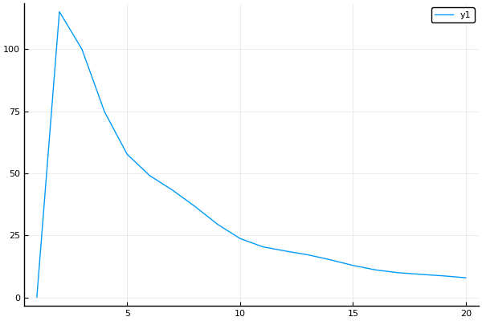

```julia
using NPZ
using Interpolations
using Polynomials, SpecialPolynomials
using Cubature
import Base.print_matrix # print_matrix()
using Plots

pyplot()
#plotly() #zoomable results


dir = homedir()
filename = "Research/camb_test.npy"
filepath = "$dir/$filename"

function main()
    camb = npzread(filepath)
    Inter = LinearInterpolation(camb[:,1], camb[:,2])
    R = LinRange( 0.0001,2.3,10000) #must be within original range  

    
    p0 = Legendre([1])
    p2 = Legendre([0, 0, 1])
    p4 = Legendre([0, 0, 0, 0, 1])
    #println("$p0 \n $p2 \n $p4")
    #println(convert(Polynomial, p2)) #will show function

    b = 0
    f = 1
    P(k, μ, pnum) = Inter(k) * (b + μ^2 * f)^2 * pnum(μ)


    #cubature test ------------------------------------------------------
    func(x,y) = prod((x).^2 * y.^2)
    println(hcubature(x -> func(x[1],x[2]), [-1,-1],[1,1], abstol=1e-8)) 
    # 0.4444444444444444 is expectation. each int is 2/9. therefore, 4/9
    #--------------------------------------------------------------------
  
    println(hcubature(x -> P(x[1], x[2], p0), [0.1,-1],[0.2,1], abstol=1e-8))

    #Plotting----------------------------------------------
    plot(camb[:,1], camb[:,2]) #Interpolation overlap
    display(plot!(R, Inter(R)))


    logR = log10.(LinRange( 0.0001,2.3,10000))
    display(plot(logR, log10.(Inter(R))))
    #-----------------------------------------------------


end 

main()
```

```
(0.4444444444444444, 5.551115123125783e-17)
(130.99683642700825, 1.3090284434852449e-6)
```




